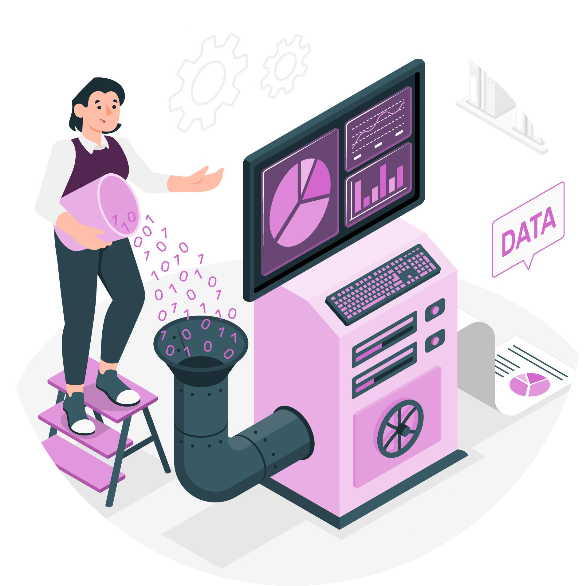
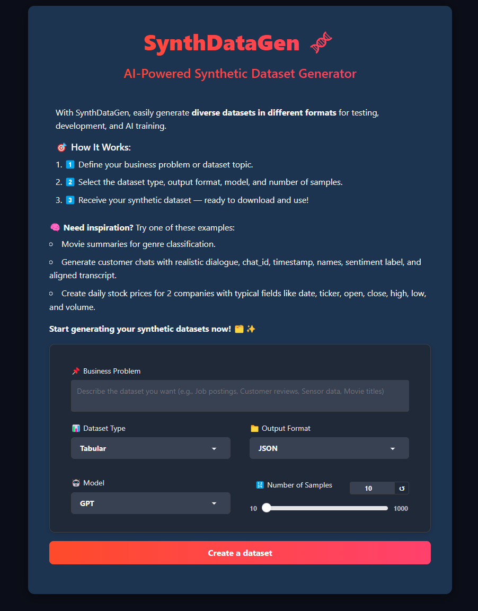
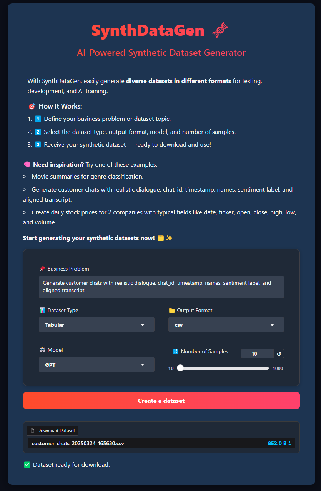
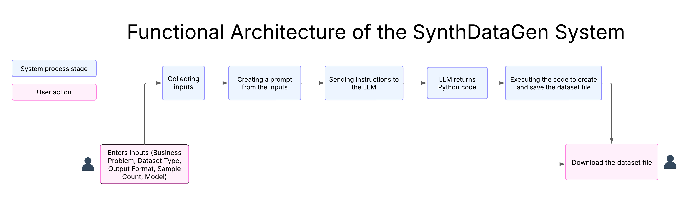
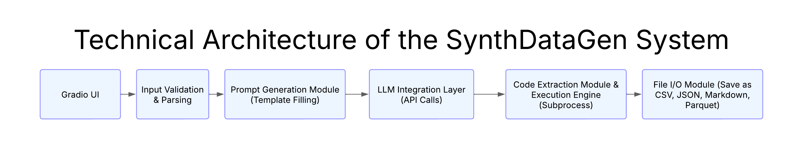

# 🧬SynthDataGen: AI-Powered Synthetic Data Generator 



<a href="https://huggingface.co/spaces/Lizk75/synthdatagen/">👀 <b>Live Demo</b></a>

📷 <b>Screenshots</b>

<a href="screenshot_1.png"></a>
<a href="screenshot_2.png"></a>


## 📖 Overview  
**SynthDataGen** (short for Synthetic Dataset Generator) is an **AI-powered** tool designed for researchers, data scientists, and developers. It allows users to **generate realistic synthetic data** on demand—no need to collect or handle real information. Simply describe the type of dataset you need, and SynthDataGen will generate it instantly.

The app features a **user-friendly** web interface built with Gradio, making it accessible to both technical and non-technical users.

### 🔑 **Key Features**  
- The app can generate **various types of datasets**, such as **tables**, **time-series data**, or **text content**.
- The output can be saved in different **formats**, including **JSON**, **CSV**, **Parquet**, or **Markdown**.
- **AI models** like **GPT** and **Claude** are used to automatically create the dataset based on the task.
- A short **description of the desired dataset** is all that's needed to trigger the generation process.
- A **download link** is provided once the dataset is ready, making it easy to save and use.
- The **interface updates options automatically** and includes helpful **examples for inspiration**. 

### 🎯 **How It Works**  
1️⃣ Describe the dataset to generate by entering a short business problem or topic.

2️⃣ Select the dataset type, output format, AI model, and number of samples.

3️⃣ Download the generated dataset once it's ready — clean, structured, and ready to use..  

### 🤔 **Why Choose SynthDataGen?**  
- ⏰ **Time Saver**: Automatically creates tables, time-series, or text data—no need to gather real data yourself.  
- ⚙️ **Flexible and Accessible**: Supports multiple formats (JSON, CSV, Parquet, Markdown) with a beginner-friendly interface.  
- 🤖 **Powered by GPT & Claude**: Uses two top AI models to produce realistic synthetic data for prototyping or research.  

### 🔧 **SynthDataGen Customization**
SynthDataGen is fully customizable through Python code. You can easily modify:
- ✏️ **System prompt** to control how the AI models generate code  
- 🤖 Easily add **new frontier** or **open-source models** (e.g., LLaMA, DeepSeek, Qwen), or integrate any model from **Hugging Face libraries** and **inference endpoints**.
- 📊 **Dataset types**, by adding new categories like image metadata, dialogue transcripts ...
- 📁 **Output formats**, such as YAML, XML ...
- 🎨 **Interface styling**, including layout, colors, and themes  

### 🏗️ **Architecture** 

<a href="func_architecture.png"></a>
<a href="tech_architecture.png"></a>

## ⚙️ Setup & Installation  

**1. Clone the Repository**  
```bash
git clone https://github.com/lisek75/synthdatagen_app.git
cd synthdatagen_app
```

**2. Install Dependencies**  

```bash
conda env create -f synthdatagen_env.yml 
conda activate synthdatagen
```
**3. Configure API Keys & Endpoints**

Create `.env` file with the following variables:
```python
OPENAI_API_KEY = your_openai_api_key
ANTHROPIC_API_KEY = your_anthropic_api_key
```
Ensure that the `.env` file remains **secure** and is not shared publicly.


## 🚀 Running the Gradio App  

**Run the Application Locally**  
```bash
python app.py
```

**Run the Application with Docker**  

To run the app using Docker, you can either build the image yourself or use the pre-built image from Docker Hub.

- Build and run the app locally:
Build the image from the provided Dockerfile using your own Docker Hub username:
```bash
docker build -t <user-dockerhub-username>/synthdatagen:v1.0.0 .
docker run -d --name synthdatagen-container -p 7861:7860 --env-file .env <user-dockerhub-username>/synthdatagen:v1.0.0
```
This will build the Docker image and run the app in a container.

- Run the app directly from Docker Hub:
Pull the pre-built image from the Docker Hub repository (⚠️make sure to use the latest version tag from Docker Hub).
Check: https://hub.docker.com/r/lizk75/synthdatagen/tags 

```bash
docker pull lizk75/synthdatagen:v1.0.0
docker run -d --name synthdatagen-container -p 7861:7860 --env-file .env lizk75/synthdatagen:v1.0.0
```


## 🧑‍💻 Usage Guide  
- You can launch the app directly from:
    - The **demo link** provided at the top of this README.
    - Or by executing it **locally** using the command `python app.py` from Visual Studio or any other IDE.
- **Describe your dataset** by entering a clear business problem or topic.
- Select the **dataset type** and **output format**.
- Choose an **AI model** (GPT or Claude).
- Set the desired **number of samples**.
- Click **Create Dataset** and download the generated file.


## 📓 Google Colab
A **notebook version** is available for users who prefer running the app in a notebook environment. The notebook includes additional **open-source models ** that require a **GPU**, which is why it's recommended to run it on Google Colab or a local machine with GPU support.

https://github.com/lisek75/nlp_llms_notebook/blob/main/07_data_generator.ipynb

